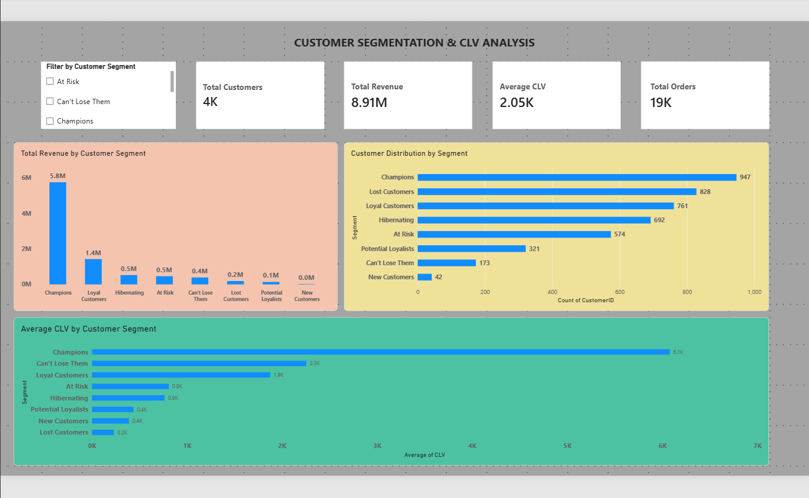

# Customer Segmentation and CLV Analysis

## 📌 Project Overview

This project analyzes customer purchasing behavior using RFM analysis, customer segmentation, revenue analysis, and Customer Lifetime Value (CLV).

The objective is to identify high-value customers, understand different customer segments, and provide data-driven business recommendations for customer retention and growth.

## 🎯 Objectives

- Analyze customer purchasing behavior
- Perform RFM analysis
- Segment customers using K-Means clustering
- Calculate customer value and CLV
- Identify high-value customer segments
- Develop business recommendations
- Create an interactive Power BI dashboard

## 🛠 Technologies Used

- Python
- Pandas
- NumPy
- Matplotlib
- Scikit-learn
- Jupyter Notebook
- Power BI
- GitHub

## 📊 Analysis Performed

### RFM Analysis

Customers were analyzed using:

- Recency
- Frequency
- Monetary Value

### Customer Segmentation

K-Means clustering was used to identify different customer segments.

The analysis identified:

- Champions
- Loyal Customers
- Can't Lose Them
- At Risk
- Hibernating
- Potential Loyalists
- New Customers
- Lost Customers

### Customer Lifetime Value

Customer value was analyzed to identify the segments that contribute the most revenue.

Champions were identified as the highest-value segment, with an average CLV of approximately £6,077.63 per customer.

## 💡 Key Findings

- Champions are the most valuable customer segment.
- Can't Lose Them customers have high customer value and should be prioritized for retention.
- Loyal Customers contribute significant revenue and should be maintained through loyalty strategies.
- At Risk and Hibernating customers provide opportunities for re-engagement.
- Potential Loyalists and New Customers represent future growth opportunities.
- Lost Customers have the lowest average CLV.

## 💼 Business Recommendations

- Develop loyalty programs for Champions.
- Prioritize retention strategies for Can't Lose Them customers.
- Strengthen engagement with Loyal Customers.
- Use targeted campaigns to re-engage At Risk and Hibernating customers.
- Develop Potential Loyalists through personalized promotions.
- Use cost-effective campaigns for Lost Customers.

## 📊 Power BI Dashboard

An interactive Power BI dashboard was created to visualize:

- Total Customers
- Total Revenue
- Average CLV
- Total Orders
- Customer Distribution by Segment
- Revenue by Customer Segment
- Average CLV by Customer Segment
- Customer Segment filtering

### Dashboard Preview

## 📁 Project Files

- `Customer_Segmentation_CLV_Analysis.ipynb` — Complete Python analysis
- `Customer_Segmentation_PowerBI.csv` — Customer-level dataset used for Power BI
- `PowerBI_Dashboard.png` — Dashboard preview
- `requirements.txt` — Python dependencies

## 📌 Conclusion

The project demonstrates how RFM analysis, customer segmentation, and customer value analysis can support data-driven marketing and customer retention decisions.

The insights can help businesses focus resources on high-value customers while developing targeted strategies for customers with potential for future growth.

## Author

Vikrant Thomas
